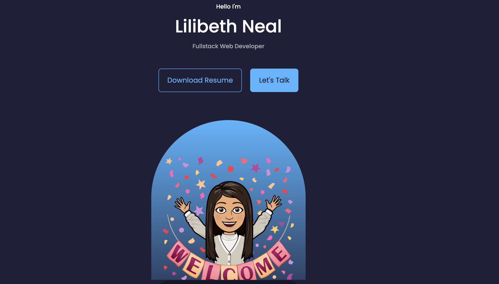

# final-portfolio 

## Description
This application was created to organize a web developer's information into a portfolio using React. With this application, an employer can view a potential employee's deployed React portfolio of work samples so that they can assess whether they're a good candidate for an open position. 

## Table of Contents
- [Installation](#installation)
- [Usage](#usage)
- [Credits](#credits)
- [License](#license)

## Installation
N/A

## Usage
The link below is the link to the deployed application. The project contains a navigation bar that has different tabs that can be viewed, these include: `About Me`, `Portfolio`, `Contact`, and `Resume`. Click on each tab to view more information. 

https://dreamy-unicorn-03d0df.netlify.app/

## Credits
React: https://react.dev/
 Boostrap: https://getbootstrap.com/

## License
MIT License

Copyright (c) 2023 Lilibeth Neal 

Permission is hereby granted, free of charge, to any person obtaining a copy
of this software and associated documentation files (the "Software"), to deal
in the Software without restriction, including without limitation the rights
to use, copy, modify, merge, publish, distribute, sublicense, and/or sell
copies of the Software, and to permit persons to whom the Software is
furnished to do so, subject to the following conditions:

The above copyright notice and this permission notice shall be included in all
copies or substantial portions of the Software.

THE SOFTWARE IS PROVIDED "AS IS", WITHOUT WARRANTY OF ANY KIND, EXPRESS OR
IMPLIED, INCLUDING BUT NOT LIMITED TO THE WARRANTIES OF MERCHANTABILITY,
FITNESS FOR A PARTICULAR PURPOSE AND NONINFRINGEMENT. IN NO EVENT SHALL THE
AUTHORS OR COPYRIGHT HOLDERS BE LIABLE FOR ANY CLAIM, DAMAGES OR OTHER
LIABILITY, WHETHER IN AN ACTION OF CONTRACT, TORT OR OTHERWISE, ARISING FROM,
OUT OF OR IN CONNECTION WITH THE SOFTWARE OR THE USE OR OTHER DEALINGS IN THE
SOFTWARE.
